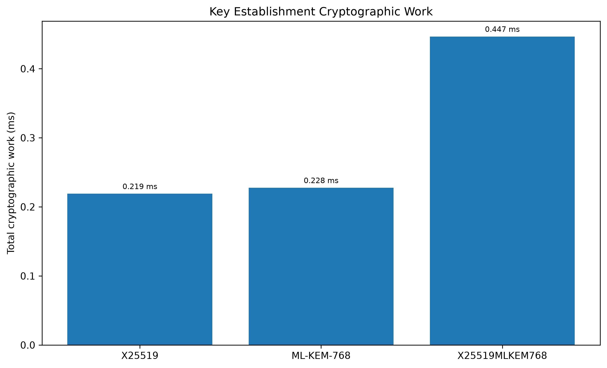
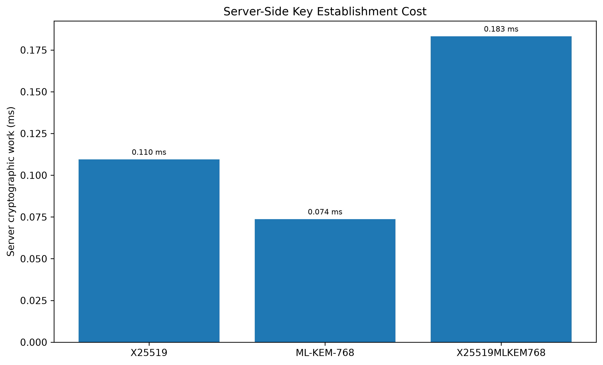
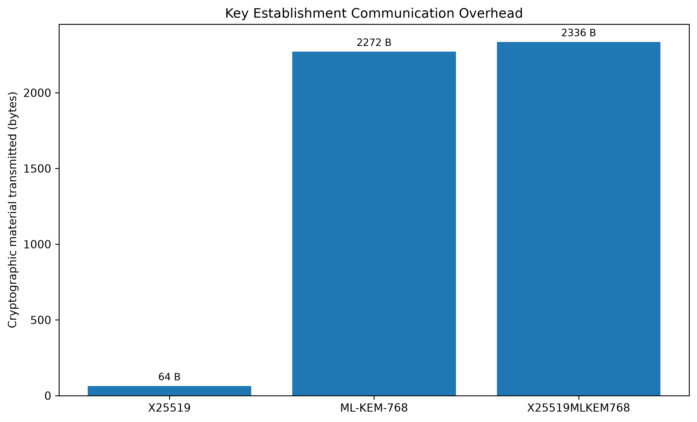
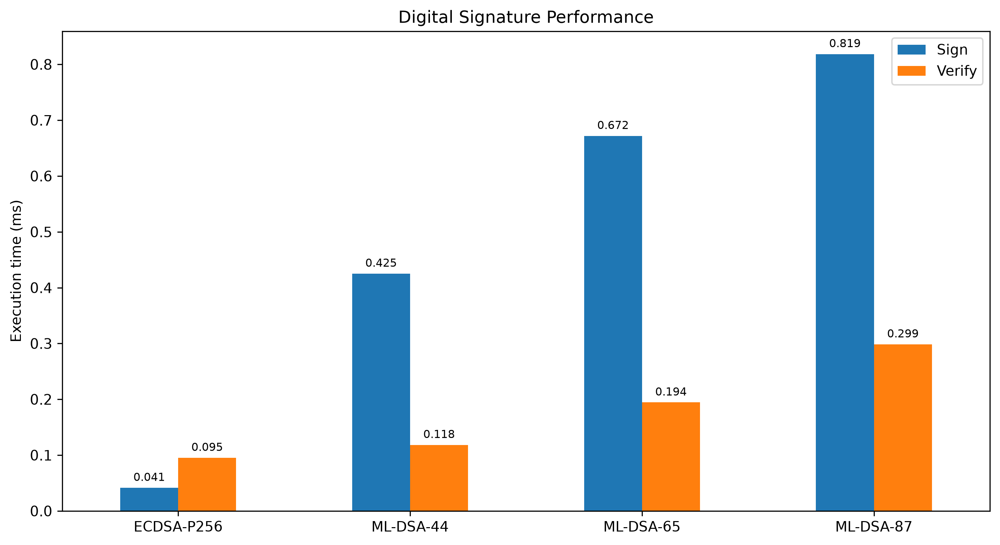
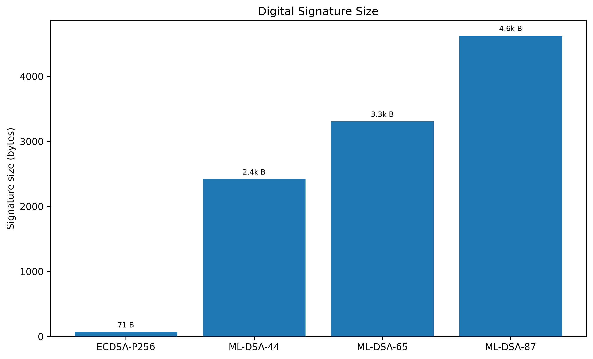
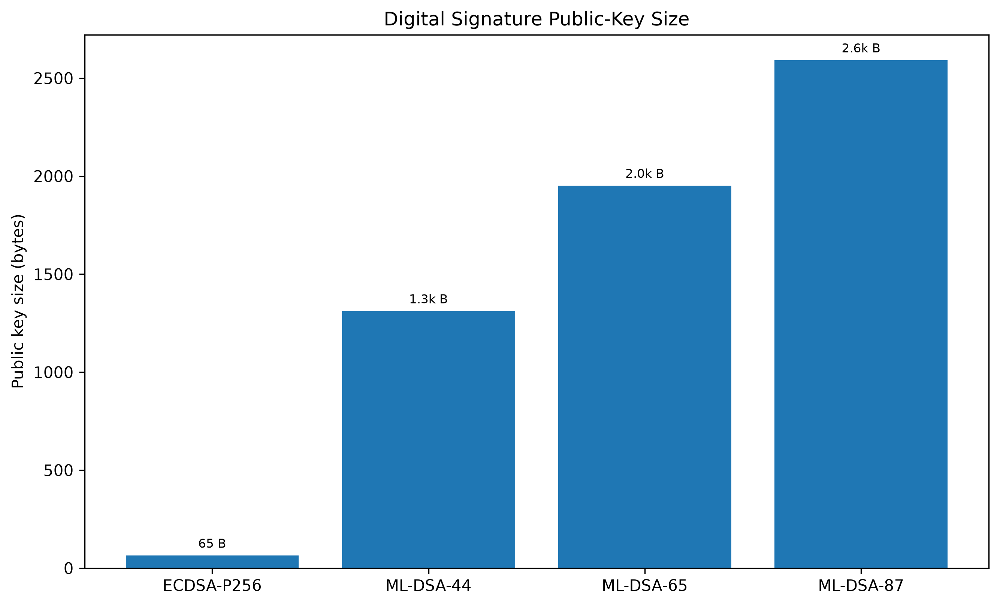
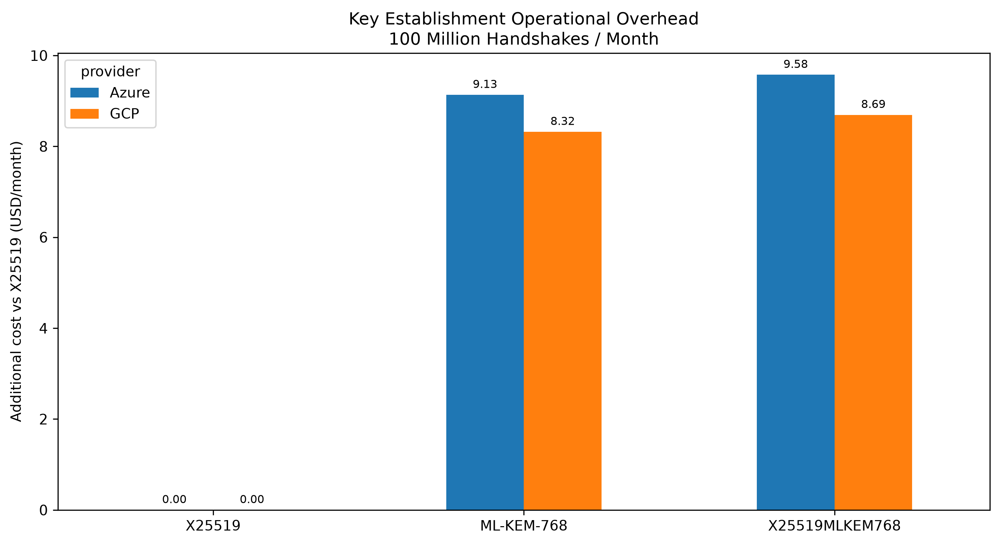
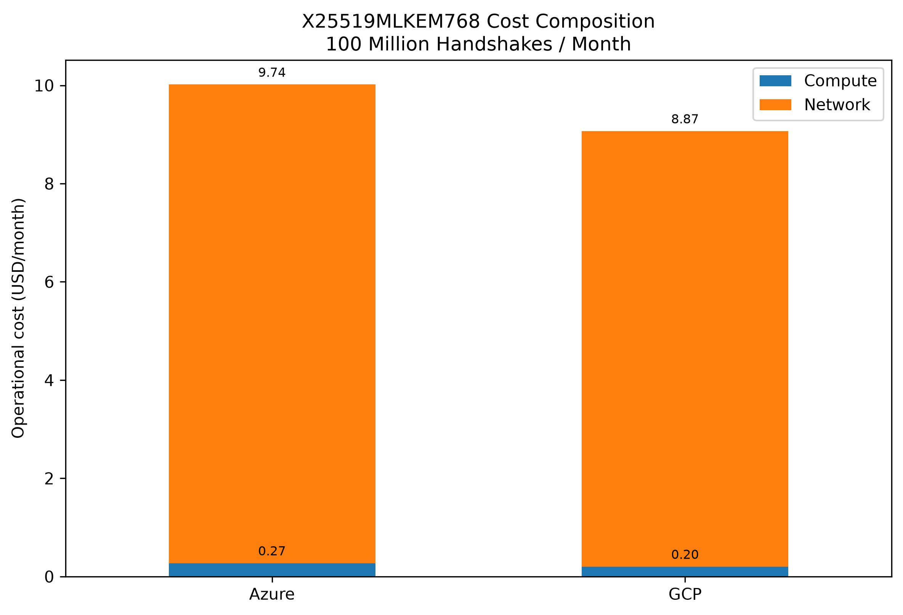
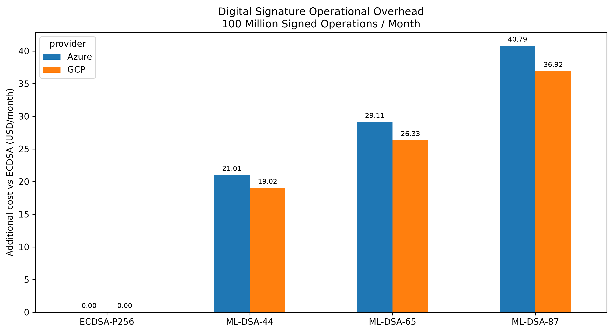
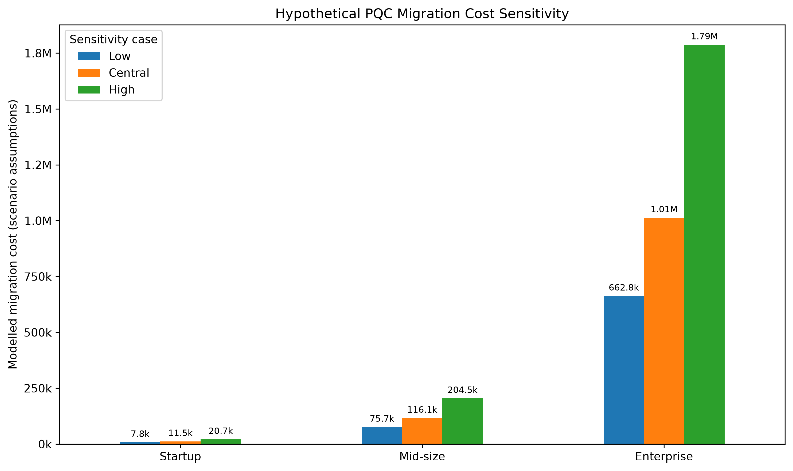

# Post-Quantum Cryptography Benchmark & Migration Cost Analysis

Experimental analysis of the technical and economic trade-offs involved in migrating from classical public-key cryptography to post-quantum cryptography (PQC).

The project benchmarks classical, post-quantum and hybrid cryptographic schemes, then translates the measured computational and communication overhead into simplified operational and migration-cost models.

The central question is:

> What are the real technical and economic trade-offs of migrating a system from classical cryptography to post-quantum cryptography?

---

## Key Findings

On the benchmark environment used in this project:

| Comparison | Main result |
|---|---:|
| ML-KEM-768 vs X25519 | **1.04×** total cryptographic work |
| ML-KEM-768 vs X25519 | **35.5×** transmitted cryptographic material |
| X25519MLKEM768 vs X25519 | **2.04×** total cryptographic work |
| X25519MLKEM768 vs X25519 | **1.67×** server-side cryptographic work |
| X25519MLKEM768 vs X25519 | **36.5×** transmitted cryptographic material |
| ML-DSA-44 signing vs ECDSA P-256 | **10.25×** |
| ML-DSA-44 verification vs ECDSA P-256 | **1.24×** |
| ML-DSA-44 signature size vs ECDSA P-256 | **34.1×** |

The most important observation is that, in this optimized environment, **ML-KEM computation is relatively inexpensive**.

The much larger difference appears in **communication size**.

At 100 million hybrid handshakes per month, approximately **97–98% of the simplified direct cloud cost modeled in this project comes from network egress rather than cryptographic CPU execution**.

---

## Measured vs Derived vs Modelled Results

The project deliberately separates three types of results.

### Measured

Directly benchmarked on the local machine:

- ML-KEM key generation
- ML-KEM encapsulation
- ML-KEM decapsulation
- X25519 key generation
- X25519 exchange
- ML-DSA key generation
- ML-DSA signing
- ML-DSA verification
- ECDSA P-256 key generation
- ECDSA P-256 signing
- ECDSA P-256 verification
- HKDF-SHA256
- Full Python hybrid-establishment diagnostic

### Derived

Calculated from measured primitive timings:

- classical X25519 key-establishment cost
- conceptual ML-KEM-768 exchange
- RFC 10024 X25519MLKEM768 client/server workload
- transmitted cryptographic material
- relative compute and traffic ratios

### Modelled

Scenario-dependent analytical estimates:

- cloud compute cost
- cloud network cost
- large-scale operational impact
- migration engineering cost
- migration sensitivity

Modelled values should not be confused with directly observed real-world costs.

---

# Cryptographic Scope

## Key Establishment

The project evaluates:

- **X25519**
- **ML-KEM-512**
- **ML-KEM-768**
- **ML-KEM-1024**
- **X25519MLKEM768**

ML-KEM is the NIST-standardized module-lattice-based key encapsulation mechanism defined in **FIPS 203**.

NIST security categories:

| Parameter set | Claimed NIST category |
|---|---:|
| ML-KEM-512 | 1 |
| ML-KEM-768 | 3 |
| ML-KEM-1024 | 5 |

ML-KEM-768 is used as the main PQ baseline in the system-level analysis.

---

## Digital Signatures

The project evaluates:

- **ECDSA P-256**
- **ML-DSA-44**
- **ML-DSA-65**
- **ML-DSA-87**

ML-DSA is standardized in **FIPS 204**.

| Parameter set | Claimed NIST category |
|---|---:|
| ML-DSA-44 | 2 |
| ML-DSA-65 | 3 |
| ML-DSA-87 | 5 |

All ML-DSA parameter sets are shown against ECDSA P-256 to study engineering scaling.

This should **not** be interpreted as a claim that every ML-DSA parameter set is a one-to-one security equivalent of ECDSA P-256.

---

# RFC 10024 Hybrid Key Establishment

The hybrid analysis follows the role assignment and byte layout of the **X25519MLKEM768** TLS 1.3 group defined in RFC 10024.

## Client share

```text
ML-KEM-768 encapsulation key    1184 B
X25519 ephemeral share            32 B
--------------------------------------
Total                           1216 B
```

## Server share

```text
ML-KEM-768 ciphertext           1088 B
X25519 ephemeral share            32 B
--------------------------------------
Total                           1120 B
```

The client:

1. generates the ML-KEM key pair;
2. generates its X25519 key pair;
3. receives the server response;
4. decapsulates the ML-KEM ciphertext;
5. computes the X25519 shared secret.

The server:

1. receives the client's ML-KEM encapsulation key;
2. performs ML-KEM encapsulation;
3. generates its X25519 key pair;
4. computes the X25519 shared secret.

The group shared secret is:

```text
ML-KEM shared secret || X25519 shared secret
```

giving:

```text
32 B + 32 B = 64 B
```

No extra hybrid-specific HKDF operation is added to the comparison.

TLS subsequently applies its own key schedule.

The implementation in this repository models these cryptographic operations and byte layouts; it is **not a complete TLS implementation**.

---

# Benchmark Methodology

Each primitive benchmark uses:

```text
100 warm-up iterations
2,000 measured iterations
10 independent runs
```

This gives approximately:

```text
20,000 measurements
```

per benchmarked primitive operation.

Results include:

- mean
- median
- P95
- P99
- standard deviation
- minimum
- maximum
- operations per second
- coefficient of variation between run means

Raw runs are preserved independently to avoid relying on a single benchmark execution.

---

# Benchmark Environment

The current canonical measurements were produced on:

```text
CPU:
AMD Ryzen 5 7520U with Radeon Graphics

Python:
3.11.9

liboqs:
0.16.0

liboqs-python:
0.16.0.1

Operating system:
64-bit Windows

liboqs build:
Release

OQS_DIST_BUILD:
ON

CPU extensions detected:
including AVX and AVX2
```

This detail is important.

An earlier version of the experiment used an automatically built liboqs binary that produced substantially slower PQC results.

The canonical results were regenerated after explicitly compiling liboqs in **Release mode** and verifying the active optimized implementation.

---

# Native liboqs Cross-Check

The Python measurements were cross-checked against the native `liboqs` benchmark utilities.

For ML-KEM-768, native Release measurements were approximately:

| Operation | Native liboqs |
|---|---:|
| Key generation | 47 µs |
| Encapsulation | 52 µs |
| Decapsulation | 59 µs |

For ML-DSA-44:

| Operation | Native liboqs |
|---|---:|
| Key generation | 74 µs |
| Signing | 285 µs |
| Verification | 80 µs |

A direct Python-wrapper validation using the same Release library produced the same order of magnitude.

This cross-check is used to detect accidental benchmarking against an unoptimized liboqs build.

---

# Key Establishment Results

## Total Cryptographic Work

| Scheme | Total crypto work | Ratio vs X25519 |
|---|---:|---:|
| X25519 | 0.219 ms | 1.00× |
| ML-KEM-768 | 0.228 ms | 1.04× |
| X25519MLKEM768 | 0.447 ms | 2.04× |



A major result is that optimized ML-KEM-768 is **not dramatically slower than X25519** in this environment when complete cryptographic work is compared.

---

## Server-Side Work

| Scheme | Server crypto work | Ratio vs X25519 |
|---|---:|---:|
| X25519 | 0.110 ms | 1.00× |
| ML-KEM-768 | 0.074 ms | 0.67× |
| X25519MLKEM768 | 0.183 ms | 1.67× |



The conceptual ML-KEM-only case requires less server-side cryptographic CPU than the X25519 model because the server performs encapsulation while the client performs ML-KEM key generation and decapsulation.

This is a role-specific result and should not be generalized into a claim that PQC is universally cheaper.

---

## Communication Overhead

| Scheme | Client → Server | Server → Client | Total |
|---|---:|---:|---:|
| X25519 | 32 B | 32 B | 64 B |
| ML-KEM-768 | 1184 B | 1088 B | 2272 B |
| X25519MLKEM768 | 1216 B | 1120 B | 2336 B |

Relative to X25519:

```text
ML-KEM-768        ≈ 35.5×
X25519MLKEM768    ≈ 36.5×
```



The communication increase is much larger than the computational increase.

---

# Hybrid End-to-End Diagnostic

The repository also contains a complete Python implementation benchmark for the hybrid establishment flow.

Aggregated result:

```text
X25519MLKEM768
mean ≈ 0.429 ms
CV   ≈ 8.4%
```

This result is marked:

```text
diagnostic_only
```

and is **not used as the canonical protocol-performance figure**.

The canonical comparison uses independently benchmarked primitives and the RFC 10024 client/server role model.

The diagnostic measurement includes Python object creation, wrapper overhead and the complete execution path.

---

# Digital Signature Results

## Performance

| Algorithm | Keygen | Sign | Verify |
|---|---:|---:|---:|
| ECDSA P-256 | 0.033 ms | 0.041 ms | 0.095 ms |
| ML-DSA-44 | 0.119 ms | 0.425 ms | 0.118 ms |
| ML-DSA-65 | 0.209 ms | 0.672 ms | 0.194 ms |
| ML-DSA-87 | 0.314 ms | 0.819 ms | 0.299 ms |



Relative to ECDSA P-256:

| Algorithm | Signing ratio | Verification ratio |
|---|---:|---:|
| ML-DSA-44 | 10.25× | 1.24× |
| ML-DSA-65 | 16.19× | 2.04× |
| ML-DSA-87 | 19.72× | 3.13× |

ML-DSA signing is clearly more expensive in this environment.

Verification is much closer to ECDSA than the signing comparison alone would suggest.

---

## Signature Size

| Algorithm | Signature |
|---|---:|
| ECDSA P-256 | ~71 B |
| ML-DSA-44 | 2420 B |
| ML-DSA-65 | 3309 B |
| ML-DSA-87 | 4627 B |

Relative to ECDSA:

```text
ML-DSA-44    ≈ 34.1×
ML-DSA-65    ≈ 46.6×
ML-DSA-87    ≈ 65.2×
```



---

## Public-Key Size

| Algorithm | Public key |
|---|---:|
| ECDSA P-256 | 65 B |
| ML-DSA-44 | 1312 B |
| ML-DSA-65 | 1952 B |
| ML-DSA-87 | 2592 B |



---

# Operational Impact

The benchmark measurements are extrapolated to workloads of:

```text
1 million
100 million
1 billion
```

operations per month.

CPU-hours represent equivalent **serial CPU-hours**.

They are not VM wall-clock hours.

---

# Key Establishment at 100 Million Handshakes / Month

## Server CPU

| Scheme | Server CPU-hours / month |
|---|---:|
| X25519 | 3.04 h |
| ML-KEM-768 | 2.05 h |
| X25519MLKEM768 | 5.09 h |

## Server Egress

| Scheme | Server crypto egress / month |
|---|---:|
| X25519 | 3.2 GB |
| ML-KEM-768 | 108.8 GB |
| X25519MLKEM768 | 112.0 GB |

Again, the larger change is network traffic rather than CPU.

---

# Cloud Cost Model

The project translates measured resource usage into simplified Azure and Google Cloud cost scenarios.

The model includes:

```text
server cryptographic compute
+
server cryptographic egress
```

Two network interpretations are supported.

### Standalone

The cryptographic workload is assumed to have access to the provider's configured free network allowance.

### Marginal

The organization's normal traffic is assumed to have already consumed the free allowance.

The marginal model is used when reporting additional PQC cost relative to the classical baseline.

Cloud pricing inputs are stored separately in:

`cost_model/config/cloud_pricing.csv`

Each pricing input records the provider, region, product, billing unit,
source type and date on which the reference value was checked.

Network-price references currently use official provider pricing pages.
Compute-instance prices are reference catalogue inputs and should still
be treated as time-sensitive modelling assumptions rather than durable
provider quotes.

---

## Key Establishment Cloud Impact

For 100 million handshakes per month:

| Provider | Scheme | Extra vs X25519 / month | Extra / year |
|---|---|---:|---:|
| Azure | ML-KEM-768 | $9.13 | $109.61 |
| Azure | X25519MLKEM768 | $9.58 | $114.90 |
| GCP | ML-KEM-768 | $8.32 | $99.84 |
| GCP | X25519MLKEM768 | $8.69 | $104.33 |



These values are outputs of the simplified model, not complete infrastructure bills.

---

# Hybrid Cost Composition

For X25519MLKEM768 at 100 million handshakes per month:

### Azure

```text
Compute     ≈ $0.27 / month
Network     ≈ $9.74 / month
Total       ≈ $10.02 / month
```

### GCP

```text
Compute     ≈ $0.20 / month
Network     ≈ $8.87 / month
Total       ≈ $9.07 / month
```



In this scenario, approximately **97–98% of the modelled direct operational cost is associated with network traffic**.

---

# Digital Signature Operational Impact

For 100 million signed objects per month:

| Algorithm | Signing CPU | Verification CPU | Signature traffic |
|---|---:|---:|---:|
| ECDSA P-256 | 1.15 h | 2.65 h | 7.1 GB |
| ML-DSA-44 | 11.81 h | 3.29 h | 242.0 GB |
| ML-DSA-65 | 18.67 h | 5.40 h | 330.9 GB |
| ML-DSA-87 | 22.74 h | 8.29 h | 462.7 GB |

The model assumes:

```text
one signature generated
+
one signature transmitted
+
one verification performed
```

Public-key or certificate-chain distribution is **not** counted once per signature.

That overhead is intentionally left for separate modelling.

---

# Signature Cloud Cost

For 100 million signed operations per month:

| Provider | Algorithm | Extra vs ECDSA / month | Extra / year |
|---|---|---:|---:|
| Azure | ML-DSA-44 | $21.01 | $252.08 |
| Azure | ML-DSA-65 | $29.11 | $349.29 |
| Azure | ML-DSA-87 | $40.79 | $489.50 |
| GCP | ML-DSA-44 | $19.02 | $228.20 |
| GCP | ML-DSA-65 | $26.33 | $315.90 |
| GCP | ML-DSA-87 | $36.92 | $443.04 |



For ML-DSA-44, network traffic again represents approximately **97% of the modelled direct operational cost**.

---

# Migration Cost Model

Direct cryptographic overhead is only one component of a real migration.

The project therefore contains a configurable migration model based on:

```text
cryptographic inventory
+
implementation
+
testing
+
PKI integration
+
deployment
+
training
+
HSM / infrastructure upgrades
```

Three hypothetical organization profiles are included:

- Startup
- Mid-size
- Enterprise

The central model produces:

| Scenario | Engineering hours | Model output |
|---|---:|---:|
| Startup | 192 h | 11,520 |
| Mid-size | 1,348 h | 116,100 |
| Enterprise | 9,400 h | 1,013,000 |

These values are **not empirical market estimates**.

They are outputs generated from configurable assumptions in:

```text
cost_model/config/migration_scenarios.csv
```

No specific real-world currency should be inferred unless the configuration explicitly defines one.

---

# Migration Sensitivity

Three sensitivity cases vary:

- engineering hours;
- hourly engineering cost;
- infrastructure / HSM cost.

| Organization | Low | Central | High |
|---|---:|---:|---:|
| Startup | 7,776 | 11,520 | 20,736 |
| Mid-size | 75,742 | 116,100 | 204,480 |
| Enterprise | 662,775 | 1,013,000 | 1,787,400 |



The generated field:

```text
idealized_parallel_months
```

is only a workload-normalization indicator calculated under perfect parallelism.

It is **not an estimate of actual migration duration**.

Real PQC migrations may involve:

- dependency discovery;
- vendor support;
- procurement;
- interoperability testing;
- compliance review;
- staged rollouts;
- certificate lifecycle changes;
- hardware replacement;
- organizational dependencies.

---

# Main Conclusion

The experiments suggest an important distinction between **relative algorithmic overhead** and **absolute operational impact**.

A naive expectation might be that post-quantum migration is primarily a CPU-performance problem.

The measurements in this environment do not support that interpretation for ML-KEM.

Instead:

```text
ML-KEM-768:
~1.04× total cryptographic work vs X25519
~35.5× cryptographic material transmitted

X25519MLKEM768:
~2.04× total cryptographic work
~36.5× cryptographic material transmitted
```

For signatures:

```text
ML-DSA-44:
~10.25× ECDSA signing time
~1.24× ECDSA verification time
~34.1× ECDSA signature size
```

Under the simplified cloud scenarios used here, **network expansion dominates the direct operational cost**.

At the same time, the configurable migration model illustrates a second hypothesis:

> The engineering and organizational work required to discover, replace, test and deploy cryptographic dependencies may be economically more significant than the direct CPU cost of executing optimized post-quantum algorithms.

The migration section is a scenario-analysis framework designed to explore this hypothesis, not a claim about universal enterprise migration prices.

---

# Repository Structure

```text
pqc-benchmark/
│
├── .github/
│   └── workflows/
│       └── tests.yml
│
├── algorithms/
│   ├── classical/
│   │   ├── x25519.py
│   │   └── ecdsa_p256.py
│   │
│   ├── post_quantum/
│   │   ├── ml_kem.py
│   │   └── ml_dsa.py
│   │
│   └── hybrid/
│       └── x25519_mlkem768.py
│
├── benchmarks/
│   ├── benchmark_ml_kem.py
│   ├── benchmark_x25519.py
│   ├── benchmark_hybrid.py
│   ├── benchmark_hkdf.py
│   ├── benchmark_ecdsa.py
│   ├── benchmark_ml_dsa.py
│   ├── run_benchmark_suite.py
│   └── run_signature_suite.py
│
├── analysis/
│   ├── aggregate_benchmarks.py
│   ├── aggregate_signatures.py
│   ├── tls_key_establishment_model.py
│   └── generate_figures.py
│
├── cost_model/
│   ├── config/
│   │   ├── migration_scenarios.csv
│   │   └── cloud_pricing.csv
│   │
│   ├── pricing.py
│   ├── operational_impact.py
│   ├── cloud_network_cost.py
│   ├── provider_compute_cost.py
│   ├── total_operational_cost.py
│   ├── signature_operational_impact.py
│   ├── signature_cloud_cost.py
│   ├── migration_cost.py
│   └── migration_sensitivity.py
│
├── results/
│   ├── raw/
│   │   ├── runs/
│   │   └── aggregated/
│   │
│   ├── economic/
│   └── figures/
│
├── tests/
│   ├── test_ml_kem.py
│   ├── test_x25519.py
│   ├── test_hybrid.py
│   └── test_signatures.py
│
├── requirements.txt
└── README.md
```

---

# Tests

The project uses `pytest`.

Run:

```powershell
python -m pytest -v
```

Current suite:

```text
18 tests
```

The tests cover:

- ML-KEM shared-secret agreement;
- ML-KEM key and ciphertext sizes;
- invalid ML-KEM parameter handling;
- X25519 agreement;
- X25519 key sizes;
- independent key generation;
- ECDSA signing and verification;
- rejection of modified ECDSA messages;
- ML-DSA signing and verification;
- rejection of modified ML-DSA messages;
- ML-DSA object sizes;
- invalid ML-DSA parameter handling;
- X25519MLKEM768 shared-secret agreement;
- hybrid secret ordering;
- 64-byte hybrid shared secret;
- RFC 10024 client-share size;
- RFC 10024 server-share size.

---

# Continuous Integration

GitHub Actions automatically:

1. checks out the repository;
2. installs Python 3.11;
3. installs C/C++ build dependencies;
4. builds liboqs 0.16.0 explicitly in **Release mode**;
5. configures `OQS_INSTALL_PATH`;
6. installs Python dependencies;
7. runs the full pytest suite.

This is particularly important because using a non-optimized liboqs build can materially distort PQC benchmark results.

---

# Installation

## Python environment

Create a virtual environment:

```powershell
py -m venv .venv
```

Activate it:

```powershell
.venv\Scripts\Activate.ps1
```

---

## liboqs

For reproducible benchmarking, this project recommends compiling liboqs explicitly in **Release mode** rather than relying on an implicit first-import build.

Required tools on Windows include:

- Git
- CMake
- Microsoft C/C++ build tools

Clone liboqs 0.16.0:

```powershell
cd $HOME

git clone --depth 1 --branch 0.16.0 `
    https://github.com/open-quantum-safe/liboqs.git `
    liboqs-release
```

Configure:

```powershell
cmake `
    -S "$HOME\liboqs-release" `
    -B "$HOME\liboqs-release\build" `
    -DBUILD_SHARED_LIBS=ON `
    -DCMAKE_WINDOWS_EXPORT_ALL_SYMBOLS=TRUE `
    -DCMAKE_INSTALL_PREFIX="$HOME\_oqs_release"
```

Build explicitly in Release mode:

```powershell
cmake --build `
    "$HOME\liboqs-release\build" `
    --config Release
```

Install:

```powershell
cmake --install `
    "$HOME\liboqs-release\build" `
    --config Release
```

Configure the current PowerShell session:

```powershell
$env:OQS_INSTALL_PATH = "$HOME\_oqs_release"
$env:Path = "$HOME\_oqs_release\bin;$env:Path"
```

Install Python dependencies:

```powershell
python -m pip install -r requirements.txt
```

Verify the library being loaded:

```powershell
python -c "import oqs; print(oqs.oqs_version()); print(oqs.native()._name)"
```

---

# Reproducing the Benchmarks

## Key-establishment suite

```powershell
python -m benchmarks.run_benchmark_suite
```

## HKDF benchmark

```powershell
1..10 | ForEach-Object {
    python -m benchmarks.benchmark_hkdf --run-id $_
}
```

## Digital signatures

```powershell
python -m benchmarks.run_signature_suite
```

## Aggregate key-establishment results

```powershell
python -m analysis.aggregate_benchmarks
```

This also regenerates the canonical RFC 10024 key-establishment model.

## Aggregate signatures

```powershell
python -m analysis.aggregate_signatures
```

---

# Reproducing the Economic Models

```powershell
python -m cost_model.operational_impact
python -m cost_model.cloud_network_cost
python -m cost_model.provider_compute_cost
python -m cost_model.total_operational_cost

python -m cost_model.signature_operational_impact
python -m cost_model.signature_cloud_cost

python -m cost_model.migration_cost
python -m cost_model.migration_sensitivity
```

Generate final figures:

```powershell
python -m analysis.generate_figures
```

---

# Reproducibility and Raw Data

Every benchmark run is stored independently:

```text
results/raw/runs/run_01/
results/raw/runs/run_02/
...
results/raw/runs/run_10/
```

Aggregated results are stored under:

```text
results/raw/aggregated/
```

The canonical key-establishment comparison is:

```text
results/raw/aggregated/tls_key_establishment_model.csv
```

The full Python hybrid benchmark is stored separately as:

```text
results/raw/aggregated/hybrid_end_to_end.csv
```

and is explicitly treated as a diagnostic measurement.

Economic outputs are stored under:

```text
results/economic/
```

Figures are generated from the CSV results rather than manually entering values.

---

# Limitations

The project is an experimental engineering study, not a production cryptographic implementation or a universal hardware benchmark.

Important limitations include:

### Single benchmark machine

Canonical performance measurements currently come from one AMD Ryzen 5 7520U Windows system.

Results may differ significantly across:

- server CPUs;
- ARM systems;
- Linux;
- cloud machines;
- different compiler toolchains.

### Different cryptographic backends

Classical algorithms are implemented through Python's `cryptography` package, while PQC algorithms use `liboqs`.

The benchmark therefore compares practical software implementations in this environment rather than providing a pure implementation-independent algorithm comparison.

### Benchmark noise

Some primitive measurements still show noticeable variation between runs.

Possible causes include:

- operating-system scheduling;
- power management;
- background processes;
- CPU frequency changes;
- Python runtime overhead.

For this reason, ten independent runs and distribution statistics are reported.

### TLS modelling

X25519MLKEM768 follows RFC 10024's cryptographic roles and byte layout, but the project does not currently execute a complete TLS handshake.

It therefore does not measure:

- complete TLS record processing;
- certificate parsing;
- network round-trip latency;
- TCP overhead;
- application processing;
- congestion;
- packet fragmentation effects.

### Signature modelling

The signature model counts signature bytes but does not yet include full PQ certificate chains.

Certificate size may be important in real deployments.

### Cloud pricing

Cloud pricing values are analytical inputs stored in:

`cost_model/config/cloud_pricing.csv`

The configuration records source metadata and the date on which each
reference price was checked.

Pricing remains time-sensitive and the model does not include:

- enterprise discounts;
- committed-use discounts;
- complete VM utilization;
- all transfer tiers;
- all regional pricing rules;
- future provider price changes.

Network pricing references use official provider pages where available,
while compute-instance values currently include third-party catalogue
references and should be interpreted accordingly.

### Migration cost

Migration scenarios are hypothetical configurable assumptions.

They are **not externally validated market estimates**.

---

# Future Work

Potential extensions include:

- benchmark on Linux;
- benchmark on server-grade hardware;
- benchmark on ARM;
- confidence intervals;
- CPU affinity and more controlled power settings;
- native C benchmarking for every primitive;
- full TLS 1.3 handshake measurements;
- packet and fragmentation analysis;
- PQ certificate-chain modelling;
- hybrid digital signatures;
- certificate and PKI storage overhead;
- additional cloud-provider models;
- dated and sourced cloud-pricing configuration;
- real migration case studies;
- cryptographic inventory tooling;
- crypto-agility analysis;
- automated benchmark regression testing.

---

# Standards and References

The project is based primarily on:

- **NIST FIPS 203** — Module-Lattice-Based Key-Encapsulation Mechanism Standard
- **NIST FIPS 204** — Module-Lattice-Based Digital Signature Standard
- **RFC 7748** — Elliptic Curves for Security
- **RFC 8446** — TLS 1.3
- **RFC 10024** — Post-Quantum Traditional Hybrid Key Agreement Mechanisms for TLS 1.3
- **Open Quantum Safe / liboqs**

---

# Author

**Antonio Aguilera Slavcheva**

Mathematical Engineering student focused on applied cryptography, post-quantum cryptography and security research.